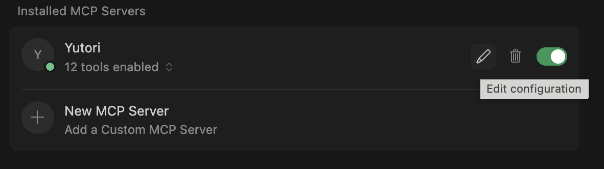

# Yutori MCP Server

An MCP server for [Yutori](https://yutori.com) - web monitoring and browsing automation.

## Features

- **Scouts**: Create agents that that monitor the web for anything you care about at a desired frequency
- **Research**: Execute one-time deep web research tasks
- **Browsing**: Execute one-time web browsing tasks using an AI website navigator (or a browser-use AI agent)

## Installation

If you don't already have `uv` installed, install it (it includes `uvx`):

```bash
curl -LsSf https://astral.sh/uv/install.sh | sh
```

Or with Homebrew:

```bash
brew install uv
```

Get your API key from [yutori.com/api](https://yutori.com/api).

<details open>
<summary>Claude Code</summary>

```bash
claude mcp add yutori --env YUTORI_API_KEY=yt-your-api-key -- uvx yutori-mcp
```
</details>

<details>
<summary>Claude Desktop</summary>

Add to your `claude_desktop_config.json`:

```json
{
  "mcpServers": {
    "yutori": {
      "command": "uvx",
      "args": ["yutori-mcp"],
      "env": {
        "YUTORI_API_KEY": "yt-your-api-key"
      }
    }
  }
}
```

For setup details, see the [Claude Desktop MCP install guide](https://modelcontextprotocol.io/docs/develop/connect-local-servers).
</details>

<details>
<summary>Cursor</summary>

**Click the button to install:**

[](https://cursor.com/en/install-mcp?name=Yutori&config=eyJjb21tYW5kIjoidXZ4IHl1dG9yaS1tY3AifQ%3D%3D)

The Cursor install button does not support env vars, so you must set `YUTORI_API_KEY` manually after install.

Set `YUTORI_API_KEY` in the server env settings (Cursor Settings → MCP), then restart the server.



**Or install manually:**

Go to Cursor Settings → MCP → Add new MCP Server, then add:

```json
{
  "mcpServers": {
    "yutori": {
      "command": "uvx",
      "args": ["yutori-mcp"],
      "env": {
        "YUTORI_API_KEY": "yt-your-api-key"
      }
    }
  }
}
```

See the [Cursor MCP guide](https://cursor.com/docs/context/mcp) for setup details.
</details>

<details>
<summary>VS Code</summary>

**Click the button to install:**

[](https://insiders.vscode.dev/redirect?url=vscode%3Amcp%2Finstall%3F%257B%2522name%2522%253A%2522yutori%2522%252C%2522command%2522%253A%2522uvx%2522%252C%2522args%2522%253A%255B%2522yutori-mcp%2522%255D%257D) [](https://insiders.vscode.dev/redirect?url=vscode-insiders%3Amcp%2Finstall%3F%257B%2522name%2522%253A%2522yutori%2522%252C%2522command%2522%253A%2522uvx%2522%252C%2522args%2522%253A%255B%2522yutori-mcp%2522%255D%257D)

Set `YUTORI_API_KEY` in your environment before first use.

**Or install manually:**

```bash
code --add-mcp '{"name":"yutori","command":"uvx","args":["yutori-mcp"],"envFile":"path/to/.env"}'
```
</details>

<details>
<summary>ChatGPT</summary>

Open ChatGPT Desktop and go to Settings -> Connectors -> MCP Servers -> Add server.

```json
{
  "mcpServers": {
    "yutori": {
      "command": "uvx",
      "args": ["yutori-mcp"],
      "env": {
        "YUTORI_API_KEY": "yt-your-api-key"
      }
    }
  }
}
```

For setup details, see the [OpenAI MCP guide](https://platform.openai.com/docs/mcp).
</details>

<details open>
<summary>Codex</summary>

```bash
codex mcp add yutori --env YUTORI_API_KEY=yt-your-api-key -- uvx yutori-mcp
```

Or add to `~/.codex/config.toml`:

```toml
[mcp_servers.yutori]
command = "uvx"
args = ["yutori-mcp"]

[mcp_servers.yutori.env]
YUTORI_API_KEY = "yt-your-api-key"
```
</details>

<details>
<summary>Gemini CLI</summary>

Add to `~/.gemini/settings.json`:

```json
{ ...file contains other config objects
  "mcp": {
    "allowed": ["yutori", "...other MCPs you already allow..."]
  },
  ...file contains other config objects
  "mcpServers": {
    "yutori": {
      "command": "uvx",
      "args": ["yutori-mcp"],
      "env": {
        "YUTORI_API_KEY": "yt-your-api-key"
      }
    }
  }
}
```

For more details, see the [Gemini CLI MCP settings guide](https://github.com/google-gemini/gemini-cli/blob/main/docs/tools/mcp-server.md#configure-the-mcp-server-in-settingsjson).
</details>

<details>
<summary>Using pip</summary>

```bash
pip install yutori-mcp
```
</details>

## Tools

All tool outputs are formatted as human-readable text optimized for LLM consumption.

### Scout Tools

#### list_scouts

List scouts for the user with optional filtering.

```json
{
  "limit": 10,
  "status": "active"
}
```

| Parameter | Required | Description |
|-----------|----------|-------------|
| `limit` | No | Max scouts to return (1-100). Default: 10 |
| `status` | No | Filter by `active`, `paused`, or `done` |

Example response:

```
Found 87 scouts: 72 active, 12 paused, 3 done.

Showing 10 of 87:

1. Yutori news and updates (active)
   Query: "Tell me about the latest news, product updates, or..."
   ID: 690bd26c-0ef8-42f4-99e4-8fca6ea20e6f
   Runs daily | Next: 2026-01-16

2. Yutori API changelog (paused)
   Query: "Monitor Yutori API changelog for breaking changes"
   ID: 36d178a0-591f-4567-8019-32d24f9e55ba
   Runs every 12 hours | Next: 2026-01-10

... (8 more)

Use list_scouts(status="active") to filter by status.
Use list_scouts(limit=50) to see more.
Use get_scout_detail(scout_id) for full details.
```

#### get_scout_detail

Get detailed information for a specific scout.

```json
{
  "scout_id": "690bd26c-0ef8-42f4-99e4-8fca6ea20e6f"
}
```

Example response:

```
Scout: Yutori news and updates
ID: 690bd26c-0ef8-42f4-99e4-8fca6ea20e6f
Status: active

Query: "Tell me about the latest news, product updates, or announcements about Yutori"

Schedule:
  Interval: daily
  Next run: 2026-01-16 18:32 UTC
  Timezone: America/Los_Angeles

Configuration:
  Webhook: not configured
  Email notifications: enabled
  Public: yes

Created: 2026-01-15
```

#### create_scout

Create a new monitoring scout for continuous web monitoring. Scouts track changes relevant to a query at a configurable schedule and alert you with structured data.

**Basic example:**

```json
{
  "query": "Tell me about the latest news, product updates, press releases, social media announcements, investments into, or other relevant information about Yutori"
}
```

**Advanced example (scheduling, webhooks, structured output):**

```json
{
  "query": "Tell me about the latest news, product updates, press releases, social media announcements, investments into, or other relevant information about Yutori",
  "output_interval": 86400,
  "user_timezone": "America/Los_Angeles",
  "skip_email": true,
  "webhook_url": "https://example.com/webhook",
  "task_spec": {
    "output_schema": {
      "type": "json",
      "json_schema": {
        "type": "object",
        "properties": {
          "stories": {
            "type": "array",
            "items": {
              "type": "object",
              "properties": {
                "headline": { "type": "string" },
                "summary": { "type": "string" },
                "source_url": { "type": "string" }
              },
              "required": ["headline", "source_url"]
            }
          }
        },
        "required": ["stories"]
      }
    }
  }
}
```

Example response:

```
Scout created successfully.

Name: Yutori news and updates
ID: 3d1d5e2a-5b6c-4a9c-8f8c-2f2e3b4a5c6d
Status: active

Query: "Tell me about the latest news, product updates, press releases, social..."
Schedule: runs daily
First run: 2026-01-07 03:10 UTC
```

| Parameter | Required | Description |
|-----------|----------|-------------|
| `query` | Yes | Natural language description of what to monitor |
| `output_interval` | No | Seconds between runs (min: 1800). Default: 86400 |
| `webhook_url` | No | URL for webhook notifications |
| `webhook_format` | No | `scout` (default), `slack`, or `zapier` |
| `task_spec` | No | JSON Schema for structured output |
| `user_timezone` | No | Timezone for scheduling |
| `skip_email` | No | Skip email notifications |
| `start_timestamp` | No | ISO timestamp for when monitoring should start |
| `user_location` | No | Location for geo-relevant searches |
| `is_public` | No | Whether scout results are publicly accessible |

#### edit_scout

Update an existing scout's query, schedule, webhook configuration, or status.

**Change status only (pause a scout):**

```json
{
  "scout_id": "abc123-...",
  "status": "paused"
}
```

**Update configuration:**

```json
{
  "scout_id": "abc123-...",
  "output_interval": 43200,
  "user_timezone": "America/New_York"
}
```

**Update configuration and resume:**

```json
{
  "scout_id": "abc123-...",
  "query": "updated monitoring query",
  "status": "active"
}
```

Example response:

```
Scout updated successfully.

Name: Yutori API changelog
ID: 7c8692c3-c637-4302-a982-b9f4f7b49407

Changes applied:
  • Status: paused → active
  • Query: "Monitor Yutori API changelog..." → "updated monitoring query"
```

| Parameter | Required | Description |
|-----------|----------|-------------|
| `scout_id` | Yes | Scout UUID |
| `status` | No | `active` (resume), `paused` (pause), or `done` (archive) |
| `query` | No | Updated monitoring query |
| `output_interval` | No | Seconds between runs (min 1800) |
| `webhook_url` | No | Webhook notification URL |
| `webhook_format` | No | `scout`, `slack`, or `zapier` |
| `user_timezone` | No | Timezone for scheduling |
| `user_location` | No | Location for geo-relevant searches |
| `is_public` | No | Whether results are public |
| `skip_email` | No | Skip email notifications |
| `task_spec` | No | JSON Schema for structured output |

#### delete_scout

Permanently delete a scout. **This cannot be undone.**

```json
{
  "scout_id": "abc123-..."
}
```

Example response:

```
Scout deleted.

ID: abc123-...

This action cannot be undone.
```

#### get_scout_updates

Get paginated updates from a scout.

```json
{
  "scout_id": "690bd26c-0ef8-42f4-99e4-8fca6ea20e6f",
  "limit": 2
}
```

Example response:

```
Found 2 update(s):

--- Update #1 —
Date: 2026-01-16 05:45 UTC

Yutori Product Updates

Yutori has released new MCP server tools for web monitoring and browsing automation...

--- Update #2 —
Date: 2026-01-15 05:45 UTC

No new findings since last update.
```

### Research Tools

#### run_research_task

Execute a one-time deep web research task. The research agent searches, reads, and synthesizes information from across the web.

**Basic example:**

```json
{
  "query": "What are the latest developments in quantum computing from the past week? Include company announcements, research papers, and product releases."
}
```

**Advanced example (webhooks, structured output):**

```json
{
  "query": "What are the latest developments in quantum computing from the past week? Include company announcements, research papers, and product releases.",
  "user_timezone": "America/Los_Angeles",
  "webhook_url": "https://example.com/webhook",
  "task_spec": {
    "output_schema": {
      "type": "json",
      "json_schema": {
        "type": "object",
        "properties": {
          "developments": {
            "type": "array",
            "items": {
              "type": "object",
              "properties": {
                "title": { "type": "string" },
                "summary": { "type": "string" },
                "source_url": { "type": "string" },
                "category": { "type": "string", "enum": ["company", "research", "product"] }
              },
              "required": ["title", "summary", "source_url"]
            }
          }
        },
        "required": ["developments"]
      }
    }
  }
}
```

Example response:

```
Research task started.

Task ID: ae27a17c-a4ed-4c69-8b2a-4bec330fc935-1768848395
Status: queued
View progress: https://scouts.yutori.com/ae27a17c-a4ed-4c69-8b2a-4bec330fc935

Poll with get_research_task_result(task_id="ae27a17c-a4ed-4c69-8b2a-4bec330fc935-1768848395") to check status.
```

| Parameter | Required | Description |
|-----------|----------|-------------|
| `query` | Yes | Natural language description of what to research |
| `user_timezone` | No | Timezone for context. Default: 'America/Los_Angeles' |
| `user_location` | No | Location for context. Default: 'San Francisco, CA, US' |
| `task_spec` | No | JSON Schema for structured output |
| `webhook_url` | No | URL for completion notification |
| `webhook_format` | No | `scout` (default), `slack`, or `zapier` |

#### get_research_task_result

Poll for the status and result of a research task. Call this after `run_research_task` until status is `succeeded` or `failed`.

```json
{
  "task_id": "ae27a17c-a4ed-4c69-8b2a-4bec330fc935-1768848395"
}
```

Example response (running):

```
Task in progress.

Task ID: ae27a17c-a4ed-4c69-8b2a-4bec330fc935-1768848395
Status: running

Poll again in a few seconds.
```

Example response (succeeded):

```
Task completed.

Task ID: ae27a17c-a4ed-4c69-8b2a-4bec330fc935-1768848395
Status: succeeded

Result:
Hardware strides and strategic moves this week

I focused on notable hardware breakthroughs, leadership changes, applied research,
and an industry appearance from January 12–19, 2026.

• MIT demonstrated chip-based cooling for trapped-ion qubits
• EeroQ unveiled a scalable quantum control chip
• IonQ appointed Katie Arrington as Chief Information Officer
• Researchers introduced QUPID, a quantum neural network
```

### Browsing Tools

#### run_browsing_task

Execute a one-time web browsing task using the navigator agent. The agent runs a cloud browser and operates it like a person - clicking, typing, scrolling, and navigating for you.

**Basic example:**

```json
{
  "task": "Give me a list of all employees (names and titles) of Yutori.",
  "start_url": "https://yutori.com"
}
```

**Advanced example (webhooks, structured output):**

```json
{
  "task": "Give me a list of all employees (names and titles) of Yutori.",
  "start_url": "https://yutori.com",
  "max_steps": 75,
  "webhook_url": "https://example.com/webhook",
  "task_spec": {
    "output_schema": {
      "type": "json",
      "json_schema": {
        "type": "object",
        "properties": {
          "employees": {
            "type": "array",
            "items": {
              "type": "object",
              "properties": {
                "name": { "type": "string" },
                "title": { "type": "string" }
              },
              "required": ["name", "title"]
            }
          }
        },
        "required": ["employees"]
      }
    }
  }
}
```

Example response:

```
Browsing task started.

Task ID: 54fb19fd-277e-4098-ab72-5a9f8a4347fc-1768848396
Status: queued
View progress: https://scouts.yutori.com/54fb19fd-277e-4098-ab72-5a9f8a4347fc

Poll with get_browsing_task_result(task_id="54fb19fd-277e-4098-ab72-5a9f8a4347fc-1768848396") to check status.
```

| Parameter | Required | Description |
|-----------|----------|-------------|
| `task` | Yes | Natural language instruction for the navigator |
| `start_url` | Yes | URL where browsing begins |
| `max_steps` | No | Max browser actions (1-100). Default: 25 |
| `task_spec` | No | JSON Schema for structured output |
| `webhook_url` | No | URL for completion notification |
| `webhook_format` | No | `scout` (default) or `slack` |

#### get_browsing_task_result

Poll for the status and result of a browsing task. Call this after `run_browsing_task` until status is `succeeded` or `failed`.

```json
{
  "task_id": "54fb19fd-277e-4098-ab72-5a9f8a4347fc-1768848396"
}
```

Example response (running):

```
Task in progress.

Task ID: 54fb19fd-277e-4098-ab72-5a9f8a4347fc-1768848396
Status: running

Poll again in a few seconds.
```

Example response (succeeded):

```
Task completed.

Task ID: 54fb19fd-277e-4098-ab72-5a9f8a4347fc-1768848396
Status: succeeded

Result:
Summary of All Yutori Employees

I have successfully located all employees of Yutori on their company page.
Here is the complete list of 17 employees with their names and titles:

Founders & Leadership:
1. Abhishek Das - Co-founder and Co-CEO
2. Devi Parikh - Co-founder and Co-CEO
3. Dhruv Batra - Co-founder and Chief Scientist

Executive:
4. Kristi Edleson - Chief of Staff

Technical Staff:
5. Rui Wang - Member of Technical Staff
... (17 employees total)

Source Page: https://yutori.com/company#team
```

## Tool Annotations

Tools include hints for client behavior:

| Tool | Annotation |
|------|------------|
| `list_scouts`, `get_scout_detail`, `get_scout_updates`, `get_browsing_task_result`, `get_research_task_result` | `readOnlyHint: true` |
| `edit_scout` | `idempotentHint: true` |
| `delete_scout` | `destructiveHint: true` |

## Development

### Setup

```bash
git clone https://github.com/yutori-ai/yutori-mcp
cd yutori-mcp
pip install -e ".[dev]"
```

### Testing

```bash
pytest
```

### Running locally

```bash
export YUTORI_API_KEY=yt-your-api-key
python -m yutori_mcp.server
```

### Debugging with MCP Inspector

```bash
npx @modelcontextprotocol/inspector yutori-mcp
```

## API Documentation

For full API documentation, visit [docs.yutori.com](https://docs.yutori.com).

## License

Apache 2.0
