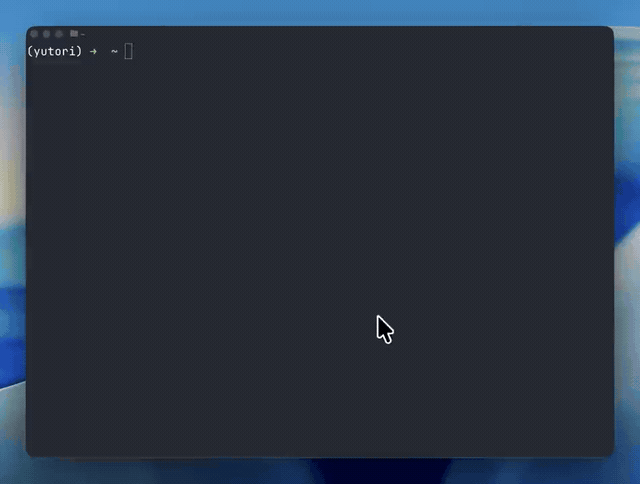

# Yutori MCP

MCP tools and skills for web monitoring, deep research, and browser automation — powered by [Yutori](https://yutori.com/api)'s web agentic tech.

You can use it with Claude Code, Codex, Cursor, VS Code, ChatGPT, OpenClaw, and other MCP hosts.

## Features

**Capabilities:**
- **Scouting** — Monitor the web continuously for anything you care about at a desired frequency
- **Research** — Run one-time deep web research tasks
- **Browsing** — Automate websites with an AI navigator
- **Computer use preview** — On macOS 15+, opt in to foreground desktop automation against the dev endpoint

### macOS computer-use preview

This development-only preview is available only when the MCP server runs on macOS with
`YUTORI_ENV=dev`. The default runner is the Python harness (needs a Python 3.11-3.13
interpreter). The legacy Node runner remains available for head-to-head comparison, but only
when explicitly asked for twice: install it with the `node-harness` extra
(`yutori-mcp[node-harness]`; it also needs Node 22 via `brew install node@22`), then select it
with `YUTORI_COMPUTER_USE_HARNESS=node` or per call with the tool's `harness` parameter. Run:

```bash
uvx yutori-mcp computer-use setup
uvx yutori-mcp computer-use doctor
uvx yutori-mcp computer-use smoke
```

`computer-use run` executes one custom task from the terminal — the same run the MCP tool
performs, with per-action progress printed as it happens:

```bash
uvx yutori-mcp computer-use run "In Calculator, compute 17 * 23 and report the result." --app Calculator --harness python
```

The `run_computer_use_task` tool controls the visible foreground desktop. Do not touch the
Mac while it runs. Visible desktop content is sent to Yutori's dev model endpoint. Only one
task can control a Mac at a time.

**Workflow skills** (for clients that support slash commands):
- [`/yutori-scout`](skills/01-scout/SKILL.md) — Set up continuous web monitoring
- [`/yutori-research`](skills/02-research/SKILL.md) — Deep web research (async, 5–10 min)
- [`/yutori-browse`](skills/03-browse/SKILL.md) — Browser automation
- [`/yutori-competitor-watch`](skills/04-competitor-watch/SKILL.md) — Competitor monitoring template
- [`/yutori-api-monitor`](skills/05-api-monitor/SKILL.md) — API/changelog monitoring template

## Installation

<details>
<summary>Requirements</summary>

If you don't already have `uv` installed, install it (it includes `uvx`):

```bash
curl -LsSf https://astral.sh/uv/install.sh | sh
```

Or with Homebrew:

```bash
brew install uv
```

Python 3.10 or higher is required (`uv` manages this automatically for most installs).

For the quickstart below, Node.js is also required (for `npx`).
</details>

### AI agent install (recommended)

Paste this into Claude Code, Codex, Cursor, Windsurf, or another coding agent:

```text
Use https://yutori.com/api/llms.txt and set up Yutori for me.
```

### Manual quick install



1. Run in terminal:

    ```bash
    uvx yutori-mcp login
    ```
    This will open Yutori Platform in your browser and save your API key locally.

    <details>
    <summary>Or, manually add your API key</summary>

    Go to (https://platform.yutori.com) and add your key to the config file:
    ```bash
    mkdir -p ~/.yutori
    cat > ~/.yutori/config.json << 'EOF'
    {"api_key": "yt-your-api-key"}
    EOF
    ```
    </details>


2. Install MCP using [add-mcp](https://neon.com/blog/add-mcp) (requires Node.js):
   ```
   npx add-mcp "uvx yutori-mcp"
   ```

    Pick the clients you want to configure.

3. Install workflow skills using [skills.sh](https://skills.sh) (requires Node.js):
   ```
   npx skills add yutori-ai/yutori-mcp -g
   ```

    Adds slash-command shortcuts like `/yutori-scout`, `/yutori-research`, and more.

    `-g` installs them at user scope. Omit `-g` if you want a project-local install instead.

   <details>
   <summary>To list or remove skills later:</summary>

   ```bash
   npx skills ls -g
   npx skills remove -g yutori-login
   ```
   </details>

4. Restart the tool you are using.


### Manual per-client install

<details>
<summary>Claude Code</summary>

1. **Plugin (Recommended)** - Includes MCP tools + workflow skills

   Type these commands in Claude Code's input (not in a terminal):
   ```
   /plugin marketplace add yutori-ai/yutori-mcp
   /plugin install yutori@yutori-plugins
   ```

   This installs both the MCP tools and workflow skills:

   | Skill | Description |
   |-------|-------------|
   | `/yutori-scout` | Set up continuous web monitoring with comprehensive queries |
   | `/yutori-research` | Deep web research workflow (async, 5-10 min) |
   | `/yutori-browse` | Browser automation tasks |
   | `/yutori-competitor-watch` | Quick competitor monitoring template |
   | `/yutori-api-monitor` | API/changelog monitoring template |

   > **Already have the MCP server installed?** Remove it first to avoid duplicate configurations:
   > ```bash
   > claude mcp remove yutori -s user   # if installed at user scope
   > claude mcp remove yutori -s local  # if installed at local/project scope
   > ```

   To uninstall the plugin later:
   ```
   /plugin uninstall yutori@yutori-plugins -s user
   ```

2. **MCP Only** (if you prefer not to use the plugin)

   ```bash
   claude mcp add --scope user yutori -- uvx yutori-mcp
   ```

   The server reads your API key from `~/.yutori/config.json` (set up via `uvx yutori-mcp login`).
</details>

<details>
<summary>Claude Desktop</summary>

Add to your `claude_desktop_config.json`:

```json
{
  "mcpServers": {
    "yutori": {
      "command": "uvx",
      "args": ["yutori-mcp"]
    }
  }
}
```

The server reads your API key from `~/.yutori/config.json`.

For setup details, see the [Claude Desktop MCP install guide](https://modelcontextprotocol.io/docs/develop/connect-local-servers).
</details>

<details>
<summary>Cursor</summary>

**Click the button to install:**

[](https://cursor.com/en/install-mcp?name=Yutori&config=eyJjb21tYW5kIjoidXZ4IHl1dG9yaS1tY3AifQ%3D%3D)

**Or install manually:**

Go to Cursor Settings → MCP → Add new MCP Server, then add:

```json
{
  "mcpServers": {
    "yutori": {
      "command": "uvx",
      "args": ["yutori-mcp"]
    }
  }
}
```

The server reads your API key from `~/.yutori/config.json`.

See the [Cursor MCP guide](https://cursor.com/docs/context/mcp) for setup details.
</details>

<details>
<summary>VS Code</summary>

**Click the button to install:**

[](https://insiders.vscode.dev/redirect?url=vscode%3Amcp%2Finstall%3F%257B%2522name%2522%253A%2522yutori%2522%252C%2522command%2522%253A%2522uvx%2522%252C%2522args%2522%253A%255B%2522yutori-mcp%2522%255D%257D) [](https://insiders.vscode.dev/redirect?url=vscode-insiders%3Amcp%2Finstall%3F%257B%2522name%2522%253A%2522yutori%2522%252C%2522command%2522%253A%2522uvx%2522%252C%2522args%2522%253A%255B%2522yutori-mcp%2522%255D%257D)

**Or install manually:**

```bash
code --add-mcp '{"name":"yutori","command":"uvx","args":["yutori-mcp"]}'
```

The server reads your API key from `~/.yutori/config.json`.
</details>

<details>
<summary>ChatGPT</summary>

Open ChatGPT Desktop and go to Settings -> Connectors -> MCP Servers -> Add server.

```json
{
  "mcpServers": {
    "yutori": {
      "command": "uvx",
      "args": ["yutori-mcp"]
    }
  }
}
```

The server reads your API key from `~/.yutori/config.json`.

For setup details, see the [OpenAI MCP guide](https://platform.openai.com/docs/mcp).
</details>

<details>
<summary>Codex</summary>

1. **MCP Server:**

   ```bash
   codex mcp add yutori -- uvx yutori-mcp
   ```

   Or add to `~/.codex/config.toml`:

   ```toml
   [mcp_servers.yutori]
   command = "uvx"
   args = ["yutori-mcp"]
   ```

   The server reads your API key from `~/.yutori/config.json`.

2. **Skills** (optional, for workflow guidance):

   Install skills using `$skill-installer` inside Codex:

   ```
   $skill-installer install https://github.com/yutori-ai/yutori-mcp/tree/main/.agents/skills/yutori-scout
   $skill-installer install https://github.com/yutori-ai/yutori-mcp/tree/main/.agents/skills/yutori-research
   $skill-installer install https://github.com/yutori-ai/yutori-mcp/tree/main/.agents/skills/yutori-browse
   $skill-installer install https://github.com/yutori-ai/yutori-mcp/tree/main/.agents/skills/yutori-competitor-watch
   $skill-installer install https://github.com/yutori-ai/yutori-mcp/tree/main/.agents/skills/yutori-api-monitor
   ```

   Or manually copy skills to your user directory (use `-L` so symlinks are dereferenced and real files are copied):

   ```bash
   git clone https://github.com/yutori-ai/yutori-mcp /tmp/yutori-mcp
   cp -rL /tmp/yutori-mcp/.agents/skills/* ~/.agents/skills/
   ```

   To uninstall manually copied skills, delete the matching directories from `~/.agents/skills/`. When updating this way, remove old Yutori skill directories first, since `cp -rL` will not delete renamed or removed skills.

   Restart Codex after installing skills.

   | Skill | Command | Description |
   |-------|---------|-------------|
   | Scout | `$yutori-scout` | Set up continuous web monitoring |
   | Research | `$yutori-research` | Deep web research (async, 5-10 min) |
   | Browse | `$yutori-browse` | Browser automation with AI navigator |
   | Competitor Watch | `$yutori-competitor-watch` | Quick competitor monitoring template |
   | API Monitor | `$yutori-api-monitor` | API/changelog monitoring template |

   See the [Codex Skills docs](https://developers.openai.com/codex/skills/) for more on skills.
</details>

<details>
<summary>OpenClaw</summary>

Follow the **Quickstart** above:

1. Install skills and MCP for OpenClaw (and optionally other tools) via [skills.sh](https://skills.sh):
   ```bash
   npx skills add yutori-ai/yutori-mcp
   ```
   When prompted, choose which Yutori skills to install and select **OpenClaw** as the tool.

</details>

<details>
<summary>Gemini CLI</summary>

Add to `~/.gemini/settings.json`. If you already have `mcp` or `mcpServers`, merge these keys into your existing config:

```json
{
  "mcp": {
    "allowed": ["yutori"]
  },
  "mcpServers": {
    "yutori": {
      "command": "uvx",
      "args": ["yutori-mcp"]
    }
  }
}
```

The server reads your API key from `~/.yutori/config.json`.

Add `"yutori"` to `mcp.allowed` if you already list other MCPs there. For more details, see the [Gemini CLI MCP settings guide](https://github.com/google-gemini/gemini-cli/blob/main/docs/tools/mcp-server.md#configure-the-mcp-server-in-settingsjson).
</details>

<details>
<summary>Run with pip</summary>

Install the package to run the MCP server (e.g. for custom or self-hosted setups):

```bash
pip install yutori-mcp
```
</details>

## Tools

See [TOOLS.md](TOOLS.md) for the full tool reference — Scout, Research, and Browsing tools with parameters, examples, and response formats.

## Development

### Setup

```bash
git clone https://github.com/yutori-ai/yutori-mcp
cd yutori-mcp
pip install -e ".[dev]"
```

### Testing

```bash
pytest
```

### Running locally

```bash
yutori-mcp login    # authenticate (one-time)
yutori-mcp          # run the server (or: python -m yutori_mcp.server)
```

### Targeting the dev environment

The server hits the production API (`https://api.yutori.com/v1`) by default.
For testing, point it at the dev stack (`https://api.dev.yutori.com/v1`) with
the `--env` flag or the `YUTORI_ENV` environment variable (the flag wins if
both are set):

```bash
yutori-mcp --env dev
```

Or in an MCP client config:

```json
{
  "mcpServers": {
    "yutori-dev": {
      "command": "uvx",
      "args": ["yutori-mcp", "--env", "dev"]
    }
  }
}
```

Setting `"env": {"YUTORI_ENV": "dev"}` in the server config works too. An
unknown environment name fails at startup rather than silently falling back
to production. Note that the `login`/`logout`/`status` auth subcommands
always talk to production; use a `YUTORI_API_KEY` valid for dev when
targeting it.

### Debugging with MCP Inspector

```bash
npx @modelcontextprotocol/inspector yutori-mcp
```

## API Documentation

For full API documentation, visit [docs.yutori.com](https://docs.yutori.com).

## License

Apache 2.0

## Computer-use preview: authenticating against dev

`login` authenticates against production and saves a production key, which the dev stack
rejects with a 401. Store a dev key separately:

```sh
uvx yutori-mcp --env dev login      # prompts for a key from platform.dev.yutori.com
uvx yutori-mcp --env dev status
uvx yutori-mcp --env dev logout
```

That writes an `environments.dev` entry alongside the existing top-level `api_key`, so one
machine can hold both without either shadowing the other. `YUTORI_API_KEY` still takes
precedence over both when set.

## Computer-use preview: harness dependencies

The macOS computer-use tool's default runner is the Python harness, with the legacy Node
runner available as an opt-in install extra for comparison (the flag and the losing harness
are expected to be removed once the evaluation concludes):

- `python` (default, base dependency): the SDK-owned n2 agent loop
  (`yutori.navigator.N2ComputerAgent`), currently pinned by commit to the private
  [`yutori-ai/yutori-sdk-python-private`](https://github.com/yutori-ai/yutori-sdk-python-private)
  fork until the SDK ships a release carrying it — after which the pin becomes a plain
  `yutori>=X` index requirement and the base install has no private git dependencies at all.
  No Cua framework, no litellm.
- `node` (opt-in, `node-harness` extra): the TypeScript runner from the private
  [`yutori-ai/yutori-sdk-typescript`](https://github.com/yutori-ai/yutori-sdk-typescript)
  repo (`yutori-computer-use-runtime`), pinned to a tag. A plain install carries no
  TypeScript runtime and no Node requirement; installing `yutori-mcp[node-harness]` adds the
  wheel, and the runtime verifies itself once installed — `verify_runner()` checks the
  manifest version, the protocol version, and the SHA-256 of the bundled `runner.mjs`.

Neither package is on any index — public or private — because the preview is unreleased, so
installing needs SSH access to the repo(s) involved:

```sh
ssh -T git@github.com          # must authenticate as a yutori-ai member
uv sync --extra dev            # base install: resolves the yutori SDK fork over SSH
uv sync --extra dev --extra node-harness   # additionally pulls the Node runtime wheel
```

`uvx yutori-mcp` alone will not resolve them without that access.
